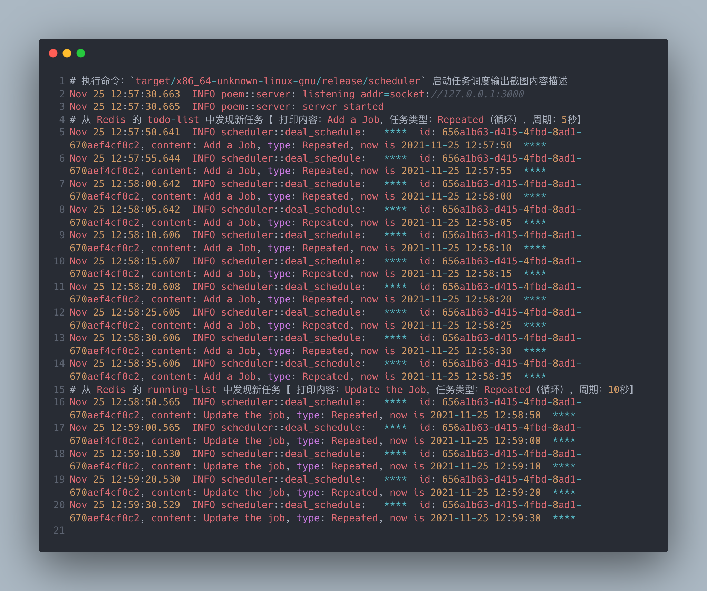

# Job Scheduler

## Introduce

### 1.Project Structure

```shell

├─1.http_server【已废弃，合并到 scheduler 模块中】
│  │
│  ├─main.rs
│  └─── 此模块代码主要实现 server 端的各类业务操作：添加任务、修改任务、查询任务、删除任务。      
│        
├─2.scheduler
│  │  
│  ├─main.rs
│  └─── 此模块代码主要实现任务调度 和 HTTP Server。 
│
├─3.rust
│  │  
│  ├─Dockerfile
│  └─── 此目录存放的是 Rust 的容器的构建步骤，docker-compose 的一部分。        
│         
└─4.docker-compose.yml
   │     
   └─── 此文件是 docker-compose 的配置文件，主要包含 Redis 容器和 Rust 容器。
```

### 2.Deploy

1. git clone

> git clone git@github.com:luckychacha/job-scheduler.git

2. checkout master branch

> git checkout master

3. docker-compose build

> docker-compose build

4. docker-compose up

> docker-compose up -d

5. If `docker-compose ps` has 2 containers(job-scheduler_rust_1 and redis) and `State` is `up`. Docker is ok.

6. cargo build in docker

> 1. `docker-compose exec rust bash`
> 
> 2. check if `x86_64-unknown-linux-gnu` is installed: `rustup target list` 
> 
> 3. `cd /var/www/myapp`
> 
> 4. `cd /var/www/myapp/scheduler` and `cargo build --release --target x86_64-unknown-linux-gnu`
> 
> 5. open another terminal and repeat step 1,3 and start scheduler: `target/x86_64-unknown-linux-gnu/release/scheduler`, keep it open and you can see how jobs scheduled, logs like this. 
> 
> 6. check if scheduler process is started: `ps -ef|grep release`, if you see the output like this, deploy is finished.
>

``` shell

root@01425bed986d:/var/www/myapp# ps -ef|grep release
root      6015  5992  0 17:44 pts/2    00:00:00 target/x86_64-unknown-linux-gnu/release/scheduler

```


### 3.接口调用

```shell

# 1. Go into rust container： `docker-compose exec rust bash`.
# 2. create a job:
curl --location --request POST 'http://localhost:3000/api/jobs' \
--header 'Content-Type: application/json' \
--data-raw '{
  "content": "Add a Job",
  "scheduleType": "Repeated",
  "duration": 5
}'

# 3. create interface response【 json 】,you can use the job id in response to query, update, delete job.
{"content":"Add a Job","duration":5,"id":"ab8bd2d2-fdcc-464d-b3fd-dfa341a3ccf5","scheduleType":"Repeated","status":"RUNNING"}


# 4. query a job by job id:
curl --location --request GET 'http://localhost:3000/api/jobs/ab8bd2d2-fdcc-464d-b3fd-dfa341a3ccf5' \
--header 'Content-Type: application/json'

# 5. query interface response【 json 】
{"content":"Add a Job","duration":5,"id":"ab8bd2d2-fdcc-464d-b3fd-dfa341a3ccf5","scheduleType":"Repeated","status":"RUNNING"}

# 6. update a job by job id:
curl --location --request PUT 'http://localhost:3000/api/jobs/ab8bd2d2-fdcc-464d-b3fd-dfa341a3ccf5' \
--header 'Content-Type: application/json' \
--data-raw '{
  "content": "Update the job",
  "scheduleType": "Repeated",
  "duration": 10
}'

# 7. delete a job by job id:
curl --location --request DELETE 'http://localhost:3000/api/jobs/ab8bd2d2-fdcc-464d-b3fd-dfa341a3ccf5' \
--data-raw ''

```